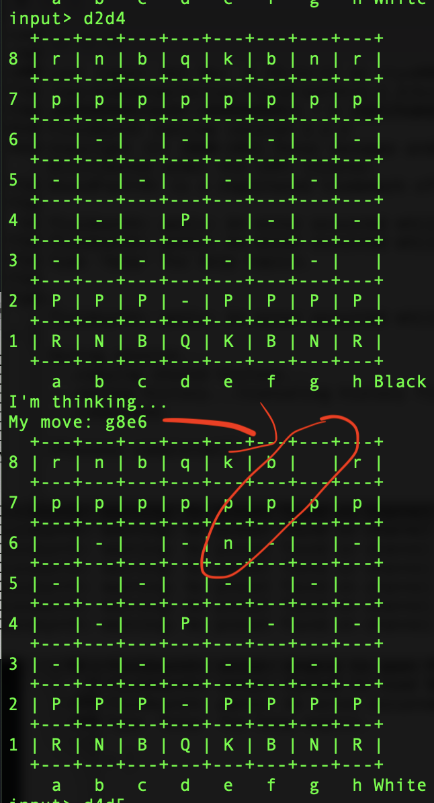
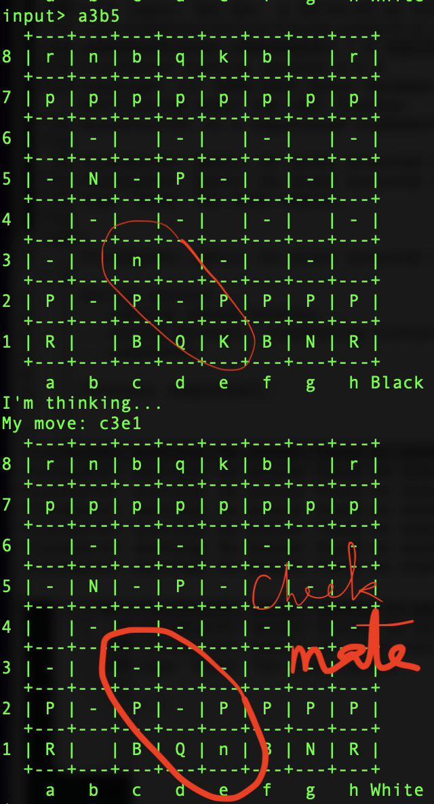

# (funny) Move examples 

#### :unicorn: Knight on Panic Attack :exclamation::exclamation::x:

- [ ] [Queen's Pawn Game](https://en.wikipedia.org/wiki/Queen's_Pawn_Game)

```haskell
input> d2d4
I'm thinking...
My move: g8e6
```

:x: `knight` jumps around :anguished:

  </img>

- [ ] (d4d5) nagging the jumping `knight` which still jumps side ways (e6c4) :exclamation:

```haskell
input> d4d5
I'm thinking...
My move: e6c4
```
- [ ] With a `Pawn`, (b2b3) chasing the jumping `knight` which finaly abides to the rules (c4a5) :tada:

```haskell
input> b2b3
I'm thinking...
My move: c4a5
```

- [ ] (b3b4) still nagging the jumping `knight` which :

* gets angry and pretty hungry
* suddenly becomes a `bishop` or `queen` :anguished:
* and kills the poor `Pawn` :skull:

```haskell
input> b3b4
I'm thinking...
My move: a5b4
```

  </img>
 
 - [ ] Let's move the `b1` White Knight, the `Black` knight : 

* which is now either a `Bishop` or a `Queen` 
* moves towards the `King` one step at a time

```haskell
input> b1a3
I'm thinking...
My move: b4c3
```

 - [ ] Let's move the White Knight towards victory : 

* Is the White `Knight` being able to move?
* Is the White `King` unprotected?
* Is the White `King` in `check`? :anchor:

Let's move our piece :arrow_heading_up:

 ```haskell
 input> a3b5
I'm thinking...
My move: c3e1
```

  </img>

:x: Duh, `Check Mate`

- [ ] Life ater death

* Game is not over...

```haskell
input> b5c7
I'm thinking...
My move: b8c7
```
