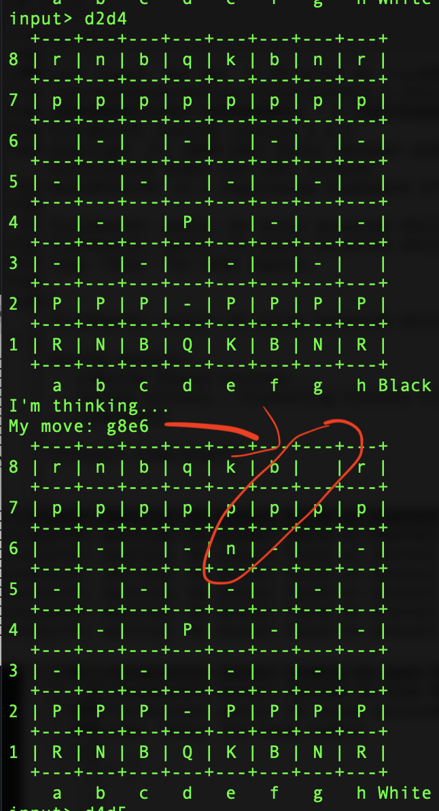
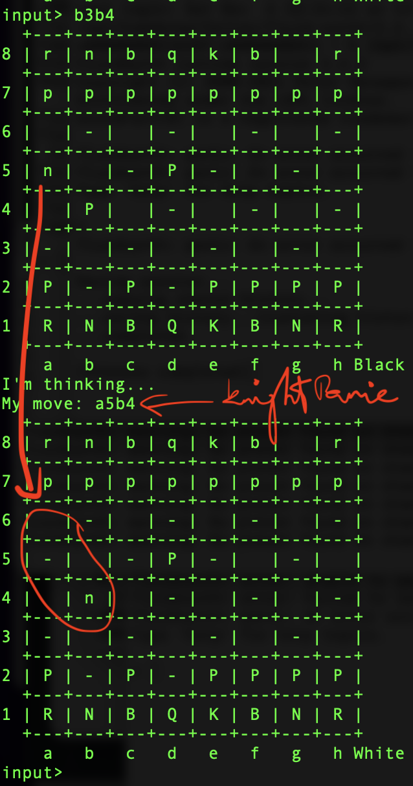
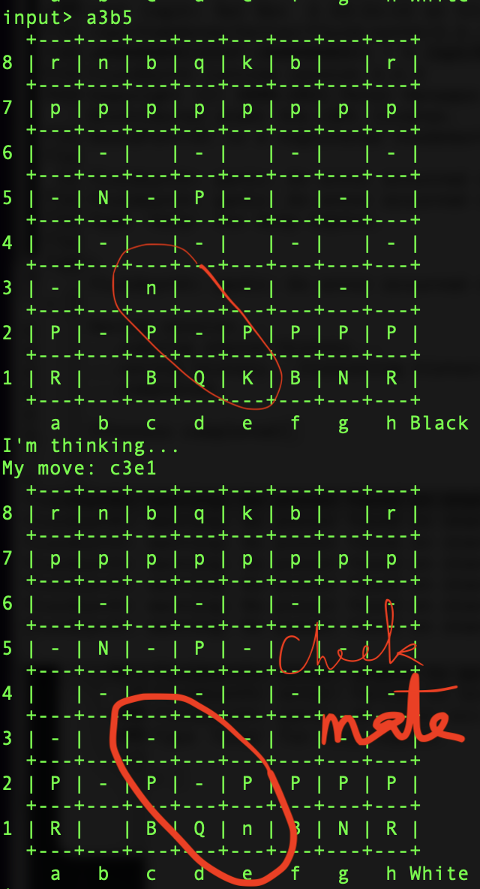

# haskell-chess

Simple, CLI-playable chess-engine.

This is a work in progress. For now, it features only an engine that tries to
take you as many pieces as possible (including your king), using the
alpha-beta algorithm.

## Features to be implemented:
* *en passant* capturing, castling;
* prevent the user from putting themselves in check;
* handle endgames properly by detecting draw and checkmate;
* improve the heuristic evaluation function to take more into account than the
  values of pieces.


## Using cabal

- [ ] Check the version

```
$ ghc --version
The Glorious Glasgow Haskell Compilation System, version 8.10.7
```

- [ ] Run the application

```
cabal run
```

## Move Examples

- [ ] Knight moving from b1 to c3

```
input> b1c3
```

## Move and ChessBoard Class Reverse Engineering

- [ ] Launch the `repl`

```
cabal repl
```

- [ ] Do some reverse Engineering to understand the moves

```haskell
*CartesianProduct> :set prompt "GHCi > "
GHCi> import Move
GHCi> KingSideCastling Color.Black
kingside castling by Black
GHCi> import ChessBoard
GHCi> (Move (2,1) (2,3), Pawn)
(c2c4,p)
GHCi> (PawnPromotion (Move (3,6) (3,7)) King)
d7d8: pawn promoted to k
```

## Move Reads

- [ ] Trial and Error to get rid of `Input.hs` source code using `readMaybe` function

```haskell
GHCi> a <- getLine
"(Move (2,1) (2,3), Pawn)"
GHCi> a
"\"(Move (2,1) (2,3), Pawn)\""
GHCi> :type a
a :: String
GHCi>  reads a :: [(String,String)]
[("(Move (2,1) (2,3), Pawn)","")]
```

- [ ] Using `import Text.Read`, removing the need to use `Input.hs`

```
GHCi > readMaybe "\"(Move (2,1) (2,3), Pawn)\"" :: Maybe String
Just "(Move (2,1) (2,3), Pawn)"
GHCi > -- or using the Chess Board coordinates to make the moves
GHCi > readMaybe "\"c2c4\"" :: Maybe String
Just "c2c4"
```

#### :unicorn: Knight on Panic Attack :exclamation::exclamation::x:

- [ ] [Queen's Pawn Game](https://en.wikipedia.org/wiki/Queen's_Pawn_Game)

```haskell
input> d2d4
I'm thinking...
My move: g8e6
```

:x: `knight` jumps around :anguished:

  </img>

- [ ] (d4d5) nagging the jumping `knight` which still jumps side ways (e6c4) :exclamation:

```haskell
input> d4d5
I'm thinking...
My move: e6c4
```
- [ ] With a `Pawn`, (b2b3) chasing the jumping `knight` which finaly abides to the rules (c4a5) :tada:

```haskell
input> b2b3
I'm thinking...
My move: c4a5
```

- [ ] (b3b4) still nagging the jumping `knight` which :

* gets angry and pretty hungry
* suddenly becomes a `bishop` or `queen` :anguished:
* and kills the poor `Pawn` :skull:

```haskell
input> b3b4
I'm thinking...
My move: a5b4
```

  </img>
 
 - [ ] Let's move the `b1` White Knight, the `Black` knight : 

* which is now either a `Bishop` or a `Queen` 
* moves towards the `King` one step at a time

```haskell
input> b1a3
I'm thinking...
My move: b4c3
```

 - [ ] Let's move the White Knight towards victory : 

 ```haskell
 input> a3b5
I'm thinking...
My move: b4c3
```

  </img>


# References

https://stackoverflow.com/questions/8689560/in-what-scenarios-does-haskells-reads-return-more-than-one-list-item


